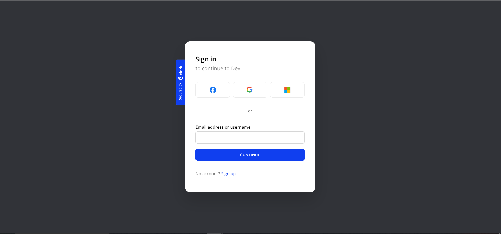
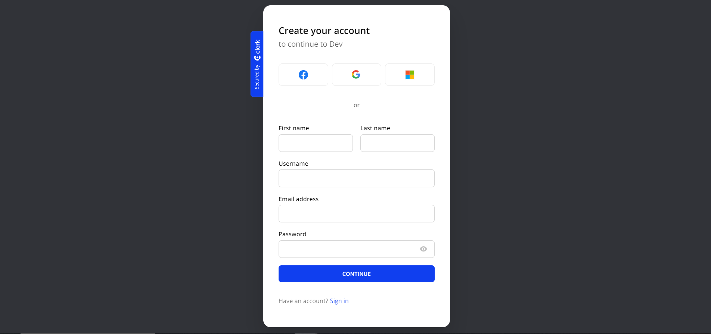
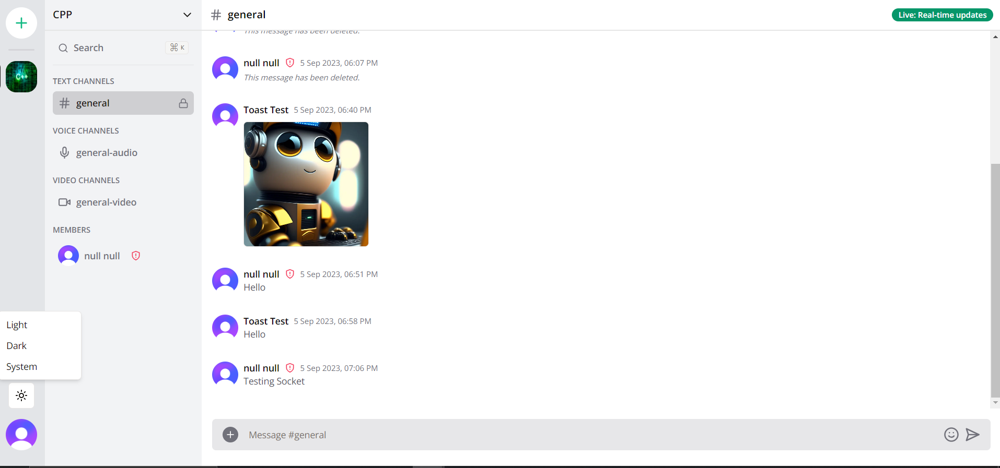
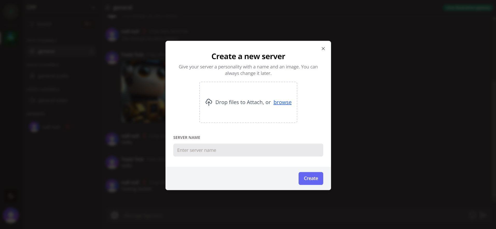
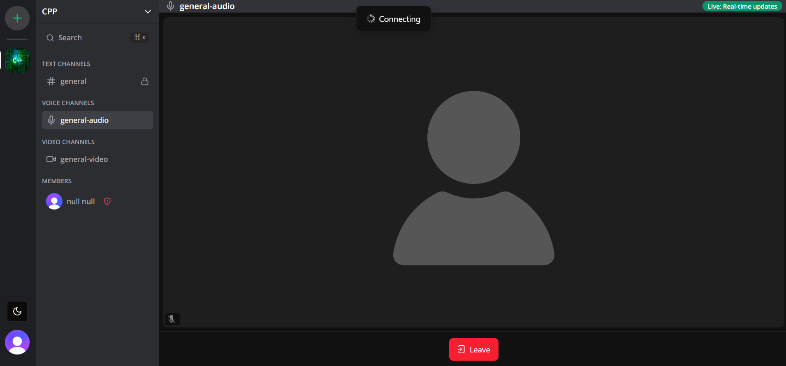
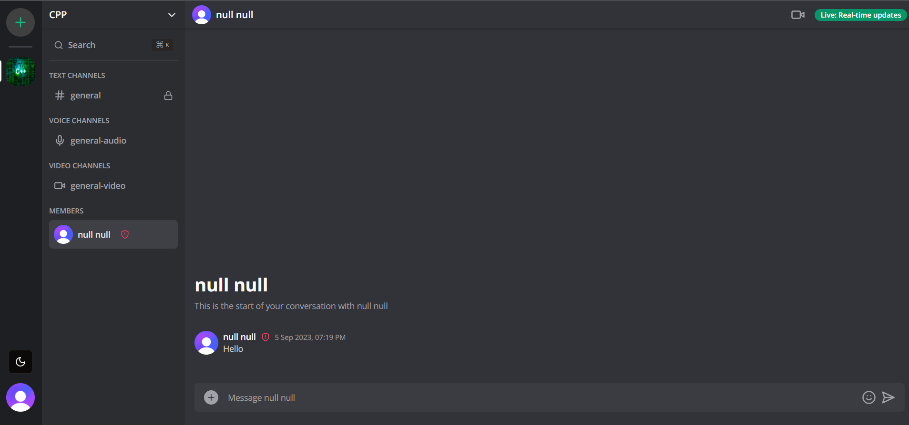

# Discord

## Key Features

1. Real-time messaging using Socket.io
2. Send attachments as messages using Supabase
3. Delete & Edit messages in real time for all users
4. Create Text, Audio and Video call (using livekit) Channels
5. conversation between members
6. video calls between members (using livekit)
7. Member management (Kick, Role change Guest / Moderator)
8. Unique invite link generation & full working invite system
9. Infinite loading for messages in batches of 10 (tanstack/query)
10. Server creation and customization
11. Beautiful UI using TailwindCSS and ShadcnUI
12. Full responsivity and mobile UI
13. Light / Dark mode
14. Websocket fallback: Polling with alerts
15. ORM using Prisma
16. MySQL database using Supabase
17. Authentication with Clerk

This is a [Next.js](https://nextjs.org/) project bootstrapped with [`create-next-app`](https://github.com/vercel/next.js/tree/canary/packages/create-next-app).

## Screenshots

<p align="center">
  
  
  
  
  
  
  
</p>

## Getting Started

First, run the development server:

```bash
npx prisma generate
npx prisma db push
npm run dev
npx prisma studio
```

Open [http://localhost:3000](http://localhost:3000) with your browser to see the result.

You can start editing the page by modifying `app/page.tsx`. The page auto-updates as you edit the file.

This project uses [`next/font`](https://nextjs.org/docs/basic-features/font-optimization) to automatically optimize and load Inter, a custom Google Font.

## Learn More

To learn more about Next.js, take a look at the following resources:

- [Next.js Documentation](https://nextjs.org/docs) - learn about Next.js features and API.
- [Learn Next.js](https://nextjs.org/learn) - an interactive Next.js tutorial.

You can check out [the Next.js GitHub repository](https://github.com/vercel/next.js/) - your feedback and contributions are welcome!

## Deploy on Vercel

The easiest way to deploy your Next.js app is to use the [Vercel Platform](https://vercel.com/new?utm_medium=default-template&filter=next.js&utm_source=create-next-app&utm_campaign=create-next-app-readme) from the creators of Next.js.

Check out our [Next.js deployment documentation](https://nextjs.org/docs/deployment) for more details.
