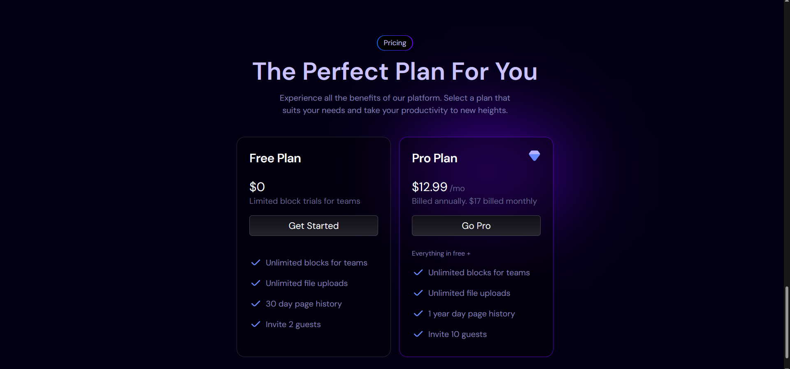
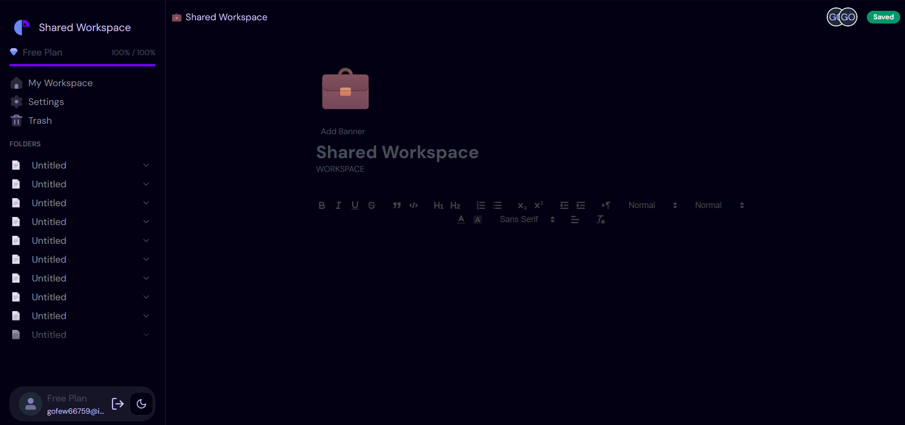

# Notion

### Features in this application.

- 🤯 Real-time cursors
- 📝 Real-time text selection
- ⏱️ Real-time database and collaboration
- 🟢 Real-time presence
- 🗑️ Move to trash functionality
- 😜 Custom emoji picker
- 🌙 Light mode dark mode
- 🚨 Next.js 14 app router
- 🗺️ Creating free plan restrictions
- 💰 Take monthly payments
- 📧 Custom email 2FA invitation
- 👨‍👨‍👧‍👦 Real-time Collaboration
- 🤑 Custom Rich text editor
- 📚 Update profile settings
- 📍 Manage payments in a portal
- 🔐 Supabase Authentication
- ✳️ WebSockets
- 📣 Optimistic UI
- 📱 Responsive design
- [ ] Supabase Row level policy
- [ ] Deployment

## Screenshots

<p align="center">
  
  
  
  
  
  
  
  
  
  
  
  
  
  
</p>

## Getting Started

- Create Supabase Account add email template in the authentication from Supabase 2FA Email Template from bellow.
- Create Stripe Account and get `NEXT_PUBLIC_STRIPE_PUBLISHABLE_KEY` & `STRIPE_SECRET_KEY`.
- Setup stripe cli and run `stripe listen --forward-to localhost:3000/api/webhook` to get `STRIPE_WEBHOOK_SECRET`.
- Then update the `.env` file variables with credential from these account.
- Then run the development server:

```bash
npm i
npm run dev
```

<details>
 <summary>Supabase 2FA Email Template</summary>
```html
<table
  class="body-wrap"
  style="margin: 0; padding: 0; font-size: 100%; font-family: 'Avenir Next', 'Helvetica Neue', 'Helvetica', Helvetica, Arial, sans-serif; line-height: 1.65; height: 100%; background: #efefef; -webkit-font-smoothing: antialiased; -webkit-text-size-adjust: none; width: 100% !important;"
>
  <tbody>
    <tr
      style="margin: 0; padding: 0; font-size: 100%; font-family: 'Avenir Next', 'Helvetica Neue', 'Helvetica', Helvetica, Arial, sans-serif; line-height: 1.65;"
    >
      <td
        class="container"
        style="margin: 0 auto !important; padding: 0; font-size: 100%; font-family: 'Avenir Next', 'Helvetica Neue', 'Helvetica', Helvetica, Arial, sans-serif; line-height: 1.65; display: block !important; clear: both !important; max-width: 580px !important;"
      >
        <!-- Message start -->
        <table
          style="margin: 0px; padding: 0px; font-size: 100%; font-family: 'Avenir Next', 'Helvetica Neue', Helvetica, Helvetica, Arial, sans-serif; line-height: 1.65; border-collapse: collapse; width: 100%; height: 200px;"
        >
          <tbody>
            <tr
              style="margin: 0px; padding: 0px; font-size: 100%; font-family: 'Avenir Next', 'Helvetica Neue', Helvetica, Helvetica, Arial, sans-serif; line-height: 1.65; height: 136px;"
            >
              <td
                class="masthead"
                style="margin: 0px; padding: 80px 0px; font-size: 100%; font-family: 'Avenir Next', 'Helvetica Neue', Helvetica, Helvetica, Arial, sans-serif; line-height: 1.65; background: #030014; color: white; height: 136px;"
                align="center"
              >
                
              </td>
            </tr>
            <tr
              style="margin: 0px; padding: 0px; font-size: 100%; font-family: 'Avenir Next', 'Helvetica Neue', Helvetica, Helvetica, Arial, sans-serif; line-height: 1.65; height: 473px;"
            >
              <td
                class="content"
                style="margin: 0px; padding: 30px 35px; font-size: 100%; line-height: 1.65; background: #030014; height: 473px;"
              >
                <h2
                  style="font-family: 'Avenir Next', 'Helvetica Neue', Helvetica, Helvetica, Arial, sans-serif; margin: 0px 0px 20px; padding: 0px; font-size: 28px; line-height: 1.25;"
                >
                  <span style="color: #b6b2ff;">Hi {{.Email}},</span>
                </h2>
                <p>
                  <span style="color: #b6b2ff;"
                    >Thank you for signing up with us! We're excited to have you as a part of our
                    community.&nbsp;
                    <br />
                    <br />By verifying your email, you'll gain full access to all the features and
                    benefits of Notion . If you did not create an account with us, please disregard
                    this email.
                    <br />
                  </span>
                </p>
                <table
                  style="font-size: 100%; font-family: 'Avenir Next', 'Helvetica Neue', Helvetica, Helvetica, Arial, sans-serif; margin: 0px; padding: 0px; line-height: 1.65; border-collapse: collapse; width: 98.2353%; height: 35px;"
                >
                  <tbody>
                    <tr style="margin: 0px; padding: 0px; font-size: 100%; line-height: 1.65;">
                      <td
                        style="margin: 0; padding: 0; font-size: 100%; font-family: 'Avenir Next', 'Helvetica Neue', 'Helvetica', Helvetica, Arial, sans-serif; line-height: 1.65;"
                        align="center"
                      >
                        <p
                          style="margin: 0px 0px 20px; padding: 0px; font-size: 16px; line-height: 1.65;"
                        >
                          <a
                            href="{{ .ConfirmationURL }}"
                            class="button"
                            style="margin: 0px; padding: 0px; font-size: 100%; line-height: 1.65; color: white; display: inline-block; background: #7000FF; border-style: solid; border-color: #7000FF; border-image: initial; border-width: 10px 20px 8px; font-weight: bold; border-radius: 4px;"
                            >Click to Confirm Email</a
                          >
                        </p>
                      </td>
                    </tr>
                  </tbody>
                </table>
                <p
                  style="font-family: 'Avenir Next', 'Helvetica Neue', Helvetica, Helvetica, Arial, sans-serif; margin: 0px 0px 20px; padding: 0px; font-size: 16px; line-height: 1.65; font-weight: normal;"
                >
                  <span style="color: #b6b2ff;">
                    <em
                      style="margin: 0; padding: 0; font-size: 100%; font-family: 'Avenir Next', 'Helvetica Neue', 'Helvetica', Helvetica, Arial, sans-serif; line-height: 1.65;"
                      >– Team Notion</em
                    >
                  </span>
                </p>
              </td>
            </tr>
          </tbody>
        </table>
      </td>
    </tr>
    <tr
      style="margin: 0; padding: 0; font-size: 100%; font-family: 'Avenir Next', 'Helvetica Neue', 'Helvetica', Helvetica, Arial, sans-serif; line-height: 1.65;"
    >
      <td
        class="container"
        style="margin: 0 auto !important; padding: 0; font-size: 100%; font-family: 'Avenir Next', 'Helvetica Neue', 'Helvetica', Helvetica, Arial, sans-serif; line-height: 1.65; display: block !important; clear: both !important; max-width: 580px !important;"
      >
        <span style="color: #b6b2ff;"><!-- Message start --></span>
        <table
          style="margin: 0; padding: 0; font-size: 100%; font-family: 'Avenir Next', 'Helvetica Neue', 'Helvetica', Helvetica, Arial, sans-serif; line-height: 1.65; border-collapse: collapse; width: 100% !important;"
        >
          <tbody>
            <tr
              style="margin: 0; padding: 0; font-size: 100%; font-family: 'Avenir Next', 'Helvetica Neue', 'Helvetica', Helvetica, Arial, sans-serif; line-height: 1.65;"
            >
              <td
                class="content footer"
                style="margin: 0; padding: 30px 35px; font-size: 100%; font-family: 'Avenir Next', 'Helvetica Neue', 'Helvetica', Helvetica, Arial, sans-serif; line-height: 1.65; background: none;"
                align="center"
              >
                Footer text
              </td>
            </tr>
          </tbody>
        </table>
      </td>
    </tr>
  </tbody>
</table>
```
</details>
<br>

Open [http://localhost:3000](http://localhost:3000) with your browser to see the result.

This is a [Next.js](https://nextjs.org/) project bootstrapped with [`create-next-app`](https://github.com/vercel/next.js/tree/canary/packages/create-next-app).
You can start editing the page by modifying `app/page.tsx`. The page auto-updates as you edit the file.

This project uses [`next/font`](https://nextjs.org/docs/basic-features/font-optimization) to automatically optimize and load Inter, a custom Google Font.

## Learn More

To learn more about Next.js, take a look at the following resources:

- [Next.js Documentation](https://nextjs.org/docs) - learn about Next.js features and API.
- [Learn Next.js](https://nextjs.org/learn) - an interactive Next.js tutorial.

You can check out [the Next.js GitHub repository](https://github.com/vercel/next.js/) - your feedback and contributions are welcome!

## Deploy on Vercel

The easiest way to deploy your Next.js app is to use the [Vercel Platform](https://vercel.com/new?utm_medium=default-template&filter=next.js&utm_source=create-next-app&utm_campaign=create-next-app-readme) from the creators of Next.js.

Check out our [Next.js deployment documentation](https://nextjs.org/docs/deployment) for more details.
