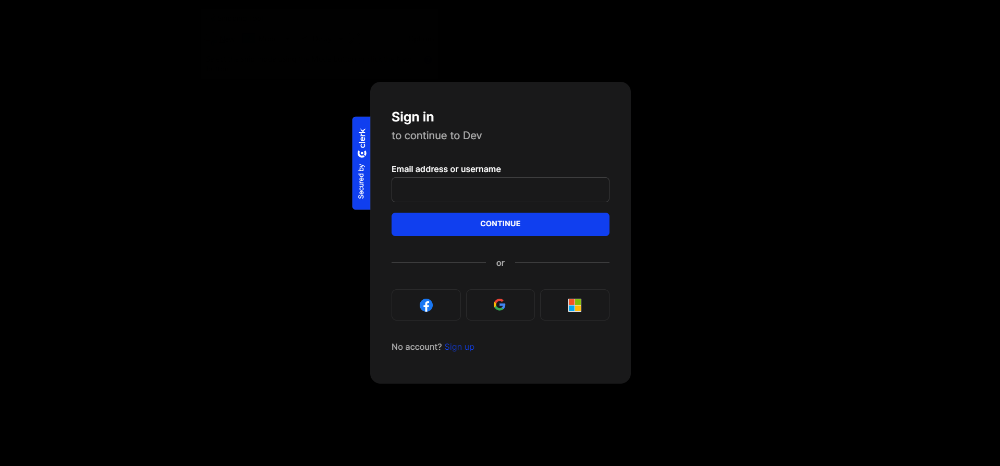
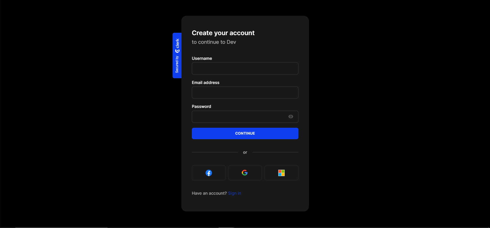
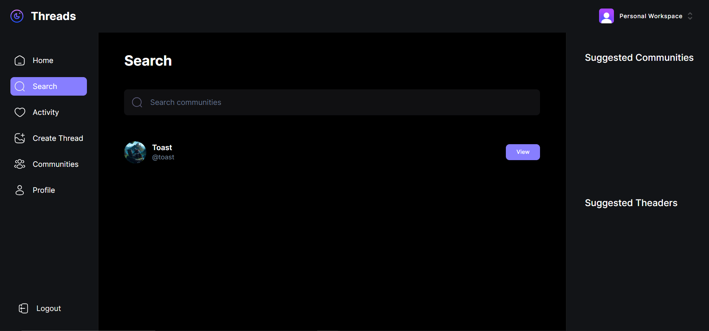
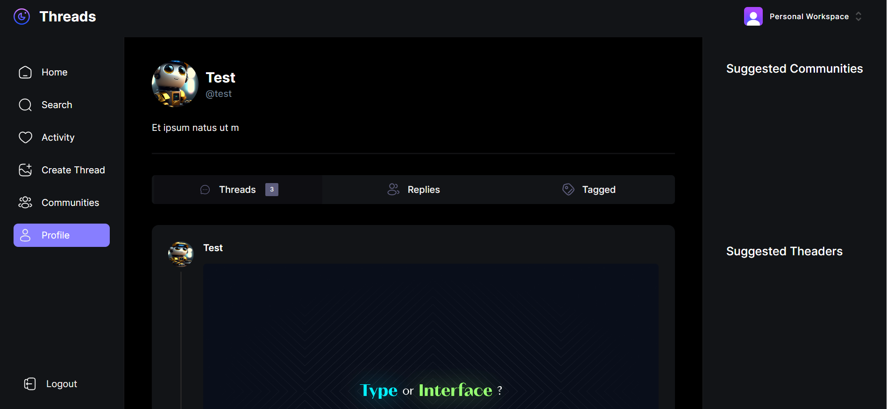
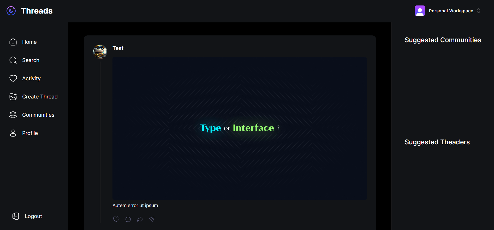
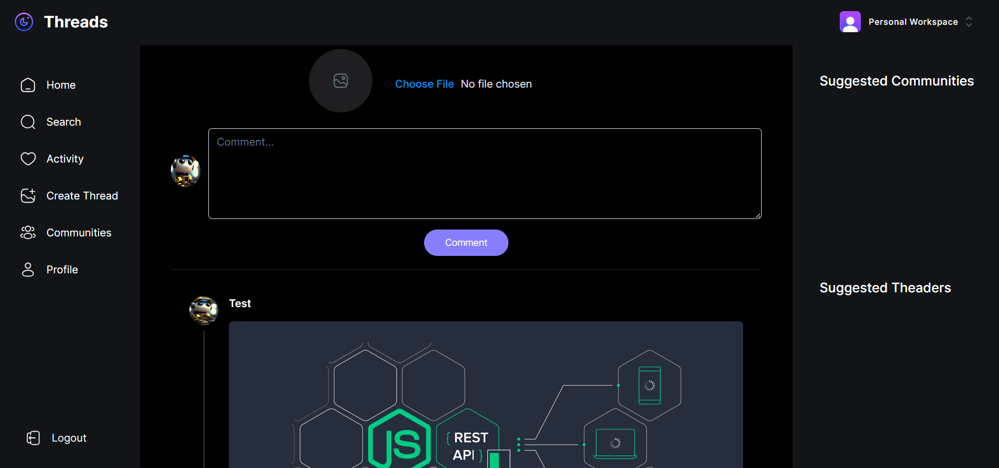

# Threads

Thread clone built using Next js, Clerk Auth, MongoDB, shadcn-ui, tailwind, zod, react-hook-form. User can create and reply to others thread as well as join a community or create one. Admin of a community can create thread as the community. User can search users or communities from the search or communities navigation. User view any activity of their threads for example if some one reply to your thread you will be able view all these in the activity page. User can view his profile and will be able to view all his thread there.

## Screenshots

<p align="center">









</p>

## To Run

1. Create a MongoDB Cluster and update the env variable `MONGODB_URL`.
2. Create Clerk Project and update the env variable `NEXT_PUBLIC_CLERK_PUBLISHABLE_KEY` and `CLERK_SECRET_KEY`.
3. Deploy the app and create a webhook endpoint with the `deployedurl/api/webhook/clerk` in the project webhook and update env variable `NEXT_CLERK_WEBHOOK_SECRET`. (this is needed for the community functionality whether you want to run locally or deploy)

This is a [Next.js](https://nextjs.org/) project bootstrapped with [`create-next-app`](https://github.com/vercel/next.js/tree/canary/packages/create-next-app).

## Getting Started

First, run the development server:

```bash
npm run dev
# or
yarn dev
# or
pnpm dev
```

Open [http://localhost:3000](http://localhost:3000) with your browser to see the result.

You can start editing the page by modifying `app/page.tsx`. The page auto-updates as you edit the file.

This project uses [`next/font`](https://nextjs.org/docs/basic-features/font-optimization) to automatically optimize and load Inter, a custom Google Font.

## Learn More

To learn more about Next.js, take a look at the following resources:

- [Next.js Documentation](https://nextjs.org/docs) - learn about Next.js features and API.
- [Learn Next.js](https://nextjs.org/learn) - an interactive Next.js tutorial.

You can check out [the Next.js GitHub repository](https://github.com/vercel/next.js/) - your feedback and contributions are welcome!

## Deploy on Vercel

The easiest way to deploy your Next.js app is to use the [Vercel Platform](https://vercel.com/new?utm_medium=default-template&filter=next.js&utm_source=create-next-app&utm_campaign=create-next-app-readme) from the creators of Next.js.

Check out our [Next.js deployment documentation](https://nextjs.org/docs/deployment) for more details.
